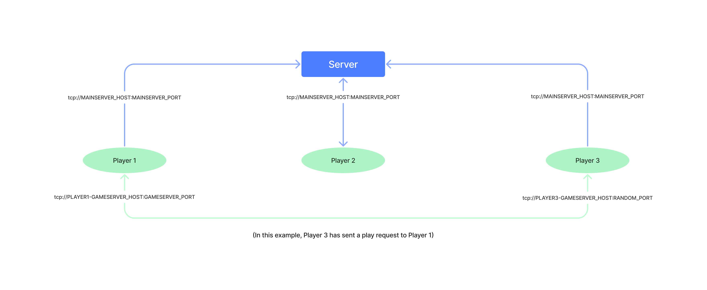

# Socket-Based Tic-Tac-Toe Game

This project implements a multiplayer Tic-Tac-Toe game using Python's sockets and threading. The game consists of three main components: `server.py`, `player.py`, and `tictactoe.py`.

## `server.py`

This script sets up a server to manage player registrations and game requests. It listens for incoming connections from players, handles their requests, and maintains a list of registered players. The available player requests are:

- **register**: Registers a new player and assigns them a unique name, IP address, and a randomly selected port for game communication.
- **get_list**: Retrieves a list of all registered players.
- **end_game**: Removes a player from the list and closes their connection.
- **change_status**: Changes a player's status between "READY_TO_PLAY" and "IN_GAME".

## `player.py`

This script simulates a player's interaction with the game. It connects to the server to register and communicate, and also listens for game requests from other players. The player can initiate a game by selecting an opponent from the list of available players. The game communication is done through a separate socket.

The player's functionality includes:

- Registering with the main server.
- Creating a game server socket to accept incoming game requests.
- Initiating a game by selecting an opponent from the list.
- Playing the Tic-Tac-Toe game with the selected opponent.

## `tictactoe.py`

This file contains the core logic for the Tic-Tac-Toe game. It defines the game matrix, player symbols (X and O), and various functions to handle the game flow:

- `print_matrix()`: Prints the current game board.
- `clean_matrix()`: Resets the game board.
- `validate_input(x, y)`: Validates player input for moves.
- `get_input(currentPlayer)`: Takes player input for making a move.
- `check_rows()`, `check_columns()`, `check_diagonals()`: Checks for winning conditions.
- `check_winner()`: Checks if there is a winner.

## How to Run

1. Run the `server.py` script to start the main server.
2. Run multiple instances of `player.py` for different players. Each instance represents a player.
3. Follow the prompts in the `player.py` console to register, initiate games, and make moves.

Remember to adjust the `MAINSERVER_HOST` and `MAINSERVER_PORT` values in `player.py` to match the host and port of the running `server.py` instance.

Please note that this README provides an overview of the project's functionality. You can further enhance the code, error handling, and user experience as needed. Enjoy playing the multiplayer Tic-Tac-Toe game!
